# Bike Sharing Demand Forecasting

Hourly bike-rental demand forecasting on the Capital Bikeshare dataset
(2011-01-01 to 2012-12-31, 17,544 hourly records, 0 missing values).

This README walks through the reasoning behind every stage - not just the
final numbers - so the "why" behind each decision is visible, not only the
code.

## Pipeline

```
data/raw/bike-sharing-dataset.csv
        |
        v
   eda/eda.py                        -> eda/plots/*.png, data/processed/daily_aggregated.csv
   eda/window_outlier_analysis.py    -> eda/plots/acf_pacf_users.png, stl_decomposition.png, outliers_highlighted.png
        |
        v
   preprocessing/preprocess.py       -> data/processed/bike-sharing-{train,test}.csv
                                         data/processed/bike-sharing-windows.npz
        |
        v
   modeling/train_eval.py            -> modeling/results/model_comparison.csv (6-model comparison)
   modeling/plot_model_comparison.py -> modeling/plots/*.png
   modeling/tune_xgboost.py          -> models/xgboost_best_params.json (time-series CV tuning)
   modeling/finalize_model.py        -> models/bike_xgboost_final.json (final model)
        |
        v
   forecasting/recursive_forecast.py          -> pure recursive, single forecast origin
   forecasting/rolling_recursive_forecast.py  -> recursive re-anchored every 24h
   forecasting/sweep_reanchor_horizon.py      -> accuracy vs. re-anchor-interval trade-off
   forecasting/direct_multistep_forecast.py   -> 24 independent per-horizon models
   forecasting/plot_forecasting_results.py    -> forecasting/plots/*.png
```

Run everything from the repo root:

```bash
pip install -r requirements.txt

python eda/eda.py
python eda/window_outlier_analysis.py
python preprocessing/preprocess.py
python modeling/train_eval.py
python modeling/plot_model_comparison.py
python modeling/tune_xgboost.py
python modeling/finalize_model.py
python forecasting/recursive_forecast.py
python forecasting/rolling_recursive_forecast.py
python forecasting/sweep_reanchor_horizon.py
python forecasting/direct_multistep_forecast.py
python forecasting/plot_forecasting_results.py
```

---

## 1. EDA: which exogenous variables actually drive demand?

Ranking every candidate feature by its Spearman correlation with `users`
(Spearman rather than Pearson because `hour`/`month` are cyclical, not
linear):

| Feature | Spearman r | |
|---|---|---|
| `hour` | 0.516 | strongest single driver |
| `atemp` / `temp` | 0.43 | near-duplicate signal (corr ~0.99 with each other) |
| `hum` | -0.364 | |
| `month` | 0.132 | |
| `windspeed` | 0.117 | |
| `workingday` / `weekday` / `holiday` | <0.04 | weak in isolation - see below |

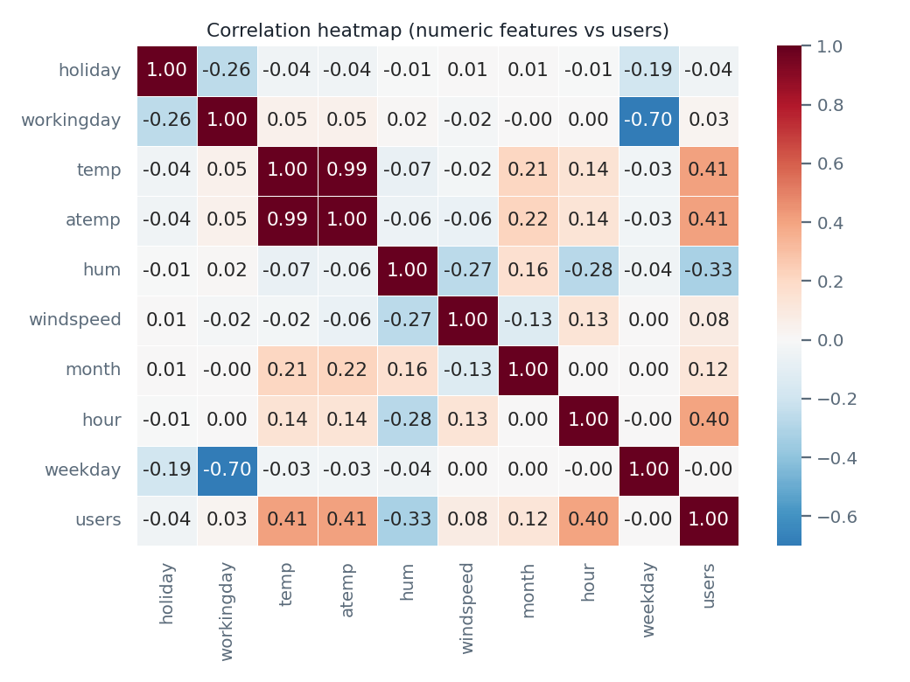

**Time of day dominates**, and the shape depends on `workingday`: a working
day has two sharp commute peaks (8h and 17h), a non-working day has one
broad midday peak instead.

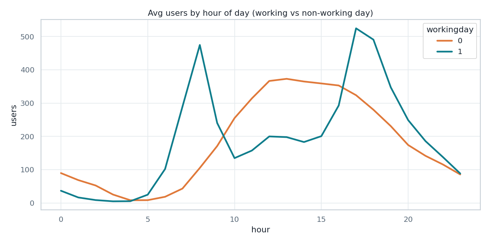

**Weather condition** matters a lot even though it's categorical, not
numeric - rain roughly halves demand vs. clear skies (ANOVA F=223,
p=1.6e-96).

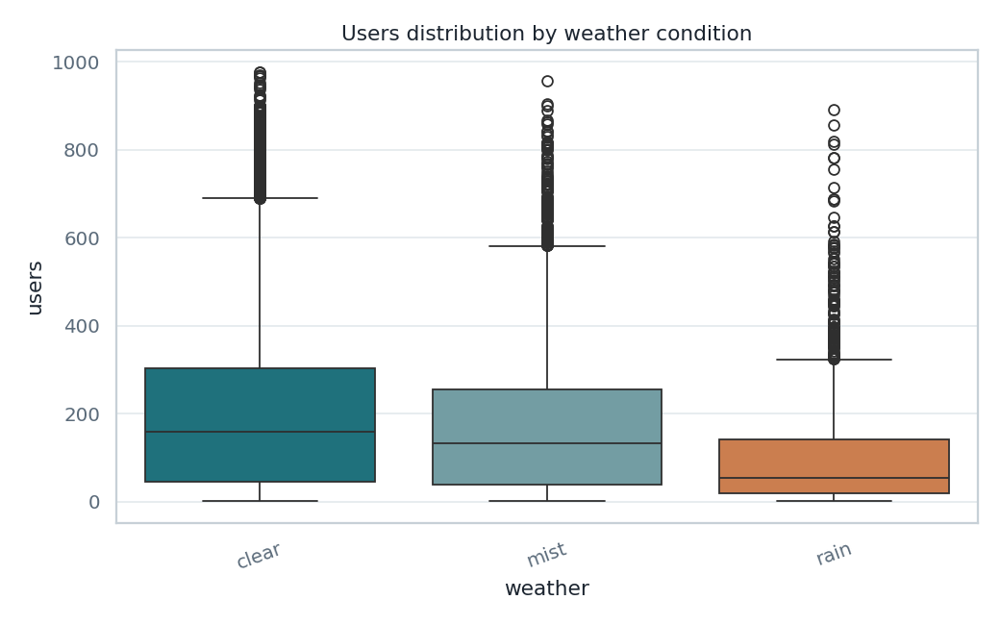
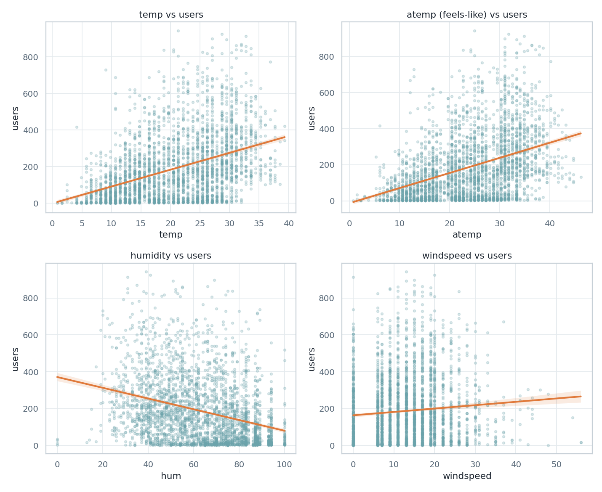

### Fixing `holiday` / `workingday`: they don't actually cover the calendar

The raw `holiday` and `workingday` columns look like they should be
complements, but they aren't - most `workingday=0` rows are just weekends,
not holidays, and 2 raw rows even have `holiday=1` **and** `workingday=1`
at the same time. Redefining them as a strict priority order fixes this:

```
1. holiday==1        -> "holiday"
2. else weekend       -> "weekend"
3. else               -> "workingday"
```

This makes the 3 flags mutually exclusive and collectively exhaustive, and
separates two effects that were previously tangled together:

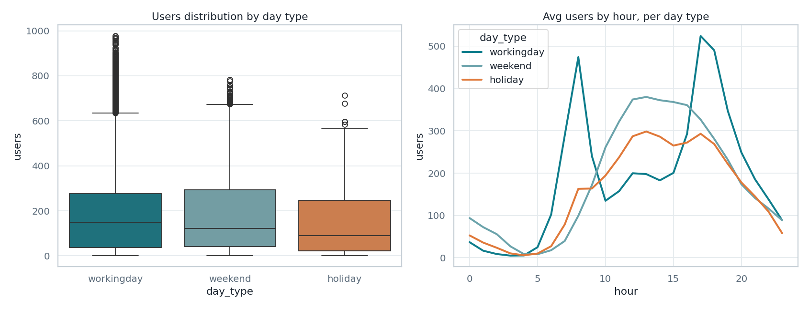

| day_type | mean users | rows |
|---|---|---|
| workingday | 191.5 | 11,982 |
| weekend | 183.0 | 5,040 |
| holiday | 150.4 | 522 |

`weekend` and `holiday` share the same "single midday peak" shape, but
`holiday` sits lower at every hour - the drop is a real holiday effect, not
just weekend noise that the original columns had conflated.

### Picking a lag/window size from the ACF

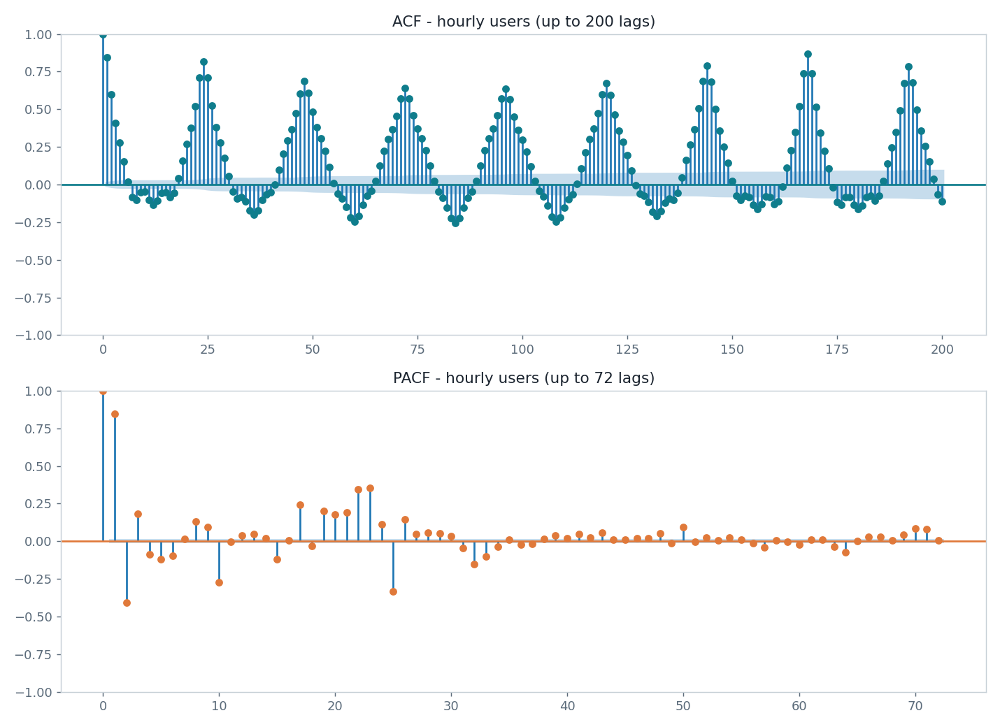

| lag (hours) | ACF |
|---|---|
| 1 | 0.845 |
| 12 | -0.134 (anti-phase - night vs. afternoon) |
| 24 | 0.820 |
| **168** | **0.871 - the single strongest lag in the series** |

The series has two overlapping cycles (daily + weekly), and the weekly one
is actually slightly stronger than the daily one. This directly motivated
using `lag_1`, `lag_24`, `lag_168` as autoregressive features, and a
168h (1-week) window for the sequence-style export.

### Are the sharp rise-then-crash swings outliers?

Checking the 10 days with the biggest single-day demand drops shows almost
all of them are rain + high wind (e.g. 2012-10-29, Hurricane Sandy: 528
users vs. a 4,507 daily average, 24/24 hours logged as rain). An STL
residual decomposition was also tried, but its residuals are dominated by
the model's trend-smoothing lag during the 2011->2012 growth ramp, not by
genuine anomalies - so it wasn't used as the final answer.

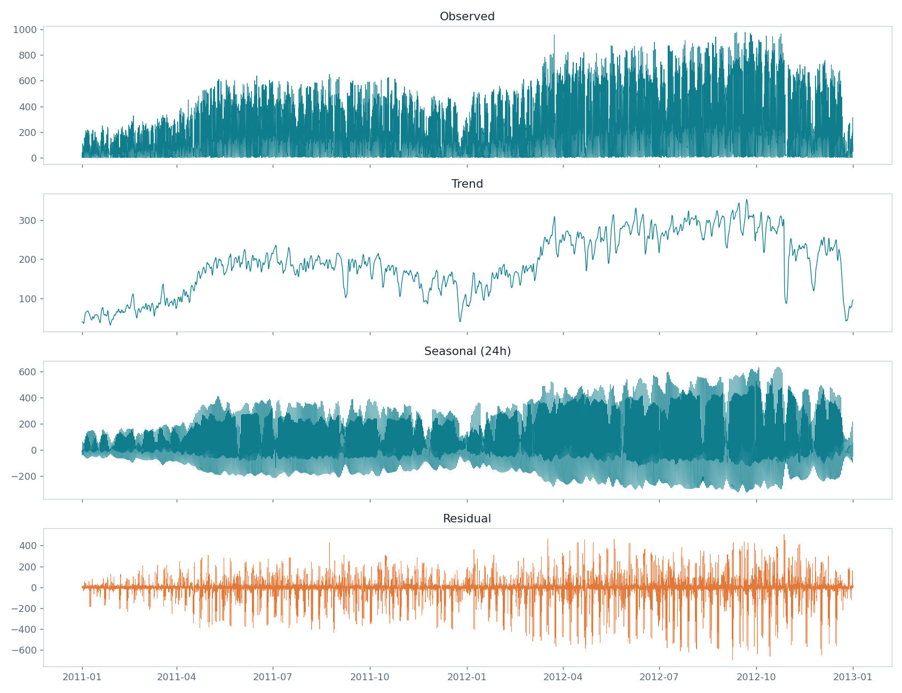

**Conclusion: these are not noise, they're weather-driven signal already
explained by `weather`/`windspeed`.** Clipping or removing them would throw
away exactly the relationship the model needs to learn, so `users` is kept
untransformed (no log, no winsorizing) - the existing weather features do
the explaining instead.

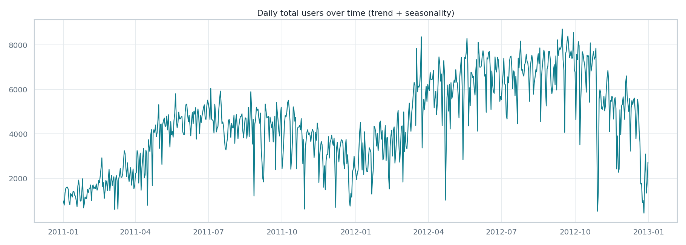

---

## 2. Preprocessing: turning the EDA findings into features

- **`weekday` -> `is_weekend`**, and `holiday`/`workingday` redefined as the
  mutually-exclusive 3-way split from section 1.
- **`weather` -> one-hot**, dropping `clear` (the 65%-majority class) as the
  baseline to avoid the dummy-variable trap for linear models.
- **Drop `temp`**, keep `atemp` (corr(temp, atemp) ~ 0.99 - redundant).
- **`atemp`/`hum`/`windspeed` -> `StandardScaler`**, fit on the train split
  only, applied to both splits (fitting on the full dataset would leak test
  statistics into training).
- **`month`/`hour` -> cyclical** (`sin`/`cos`) so hour 23 and hour 0 are
  adjacent to the model, not maximally far apart.
- **`users_lag_1` / `_24` / `_168`** added from the ACF analysis above.
- **Chronological 80/20 train/test split** (no shuffling - shuffling a time
  series leaks future information into training via adjacent lag features).

Two parallel exports come out of this: a **tabular** version (one row per
hour, scalar lag columns) for SARIMAX / tree models, and a **windowed**
version (168h sequences) for sequence models, sized so that both agree on
the same 13,867 / 3,509 train/test row counts.

---

## 3. Model comparison

Six models, evaluated one-step-ahead (true lag values available at every
step) on the same held-out test set:

| Model | MAE | RMSE | MAPE | R2 | Fit time |
|---|---|---|---|---|---|
| **XGBoost** | 30.3 | **48.2** | 24.2% | **0.952** | 0.4s |
| Random Forest | 30.6 | 50.9 | 24.1% | 0.947 | 0.9s |
| SARIMAX(2,0,1)(1,0,0,24), 1-step | 49.6 | 77.9 | 46.7% | 0.875 | 167s |
| Linear Regression | 52.7 | 79.8 | 53.6% | 0.869 | <0.01s |
| Naive (lag-168, weekly) | 67.7 | 118.8 | 74.5% | 0.709 | - |
| Naive (lag-24, daily) | 79.2 | 133.4 | 72.8% | 0.634 | - |

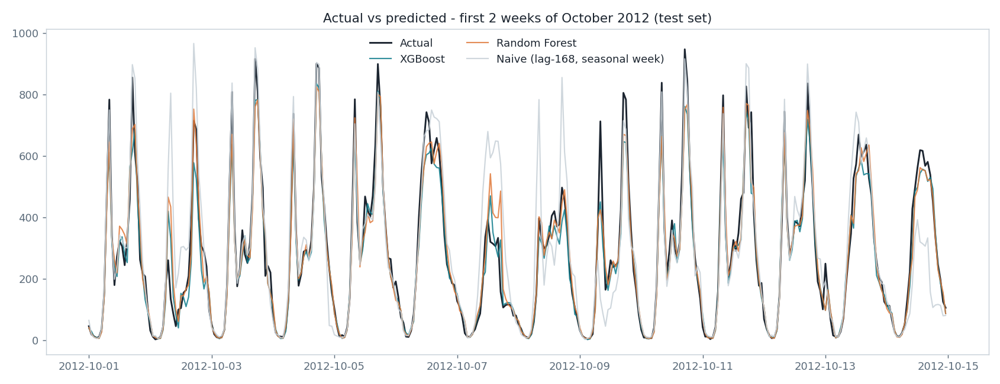
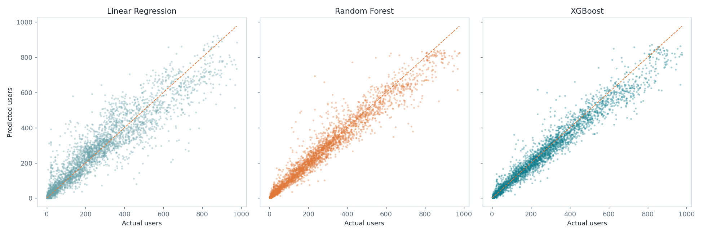

**A methodology note on SARIMAX**: a naive `forecast(steps=len(test))` call
forecasts the entire 3,509h test horizon blind (no re-anchoring), which
collapses to R2~0.27 - worse than the naive baselines - because the AR/
seasonal terms decay to the exogenous mean within a few dozen hours. That's
not a fair comparison against the ML models, which get the *true*
`lag_1/24/168` at every row. The 0.875 above comes from a rolling
one-step-ahead SARIMAX forecast (`fit.apply(...).get_prediction(...,
dynamic=False)`) instead, which conditions on the true preceding
observation at every step - the same information the lag features give the
other models.

**Why XGBoost/Random Forest win**: both capture the `hour x workingday x
weather` interaction from section 1 (the commute peak only exists on
working days) that Linear Regression and SARIMAX - both fundamentally
linear in structure - cannot represent.

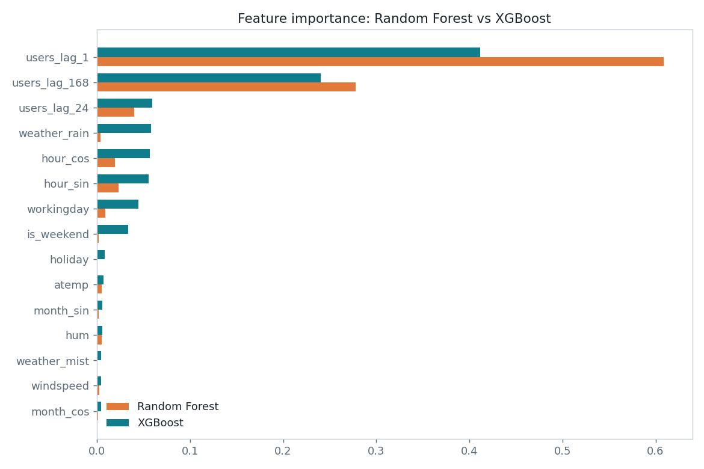
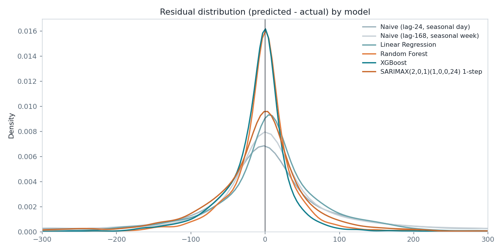

`lag_1` dominates feature importance (41-61%), with `lag_168` a distant
second - confirming the ACF finding from section 1 that recent momentum and
the weekly cycle carry almost all the signal.

### Hyperparameter tuning

`modeling/tune_xgboost.py` runs `RandomizedSearchCV` (100 candidates) with
`TimeSeriesSplit(5)` - 5 **expanding-window** folds, so no fold ever
validates on data that precedes its own training data (a random k-fold
shuffle would leak future `lag_1/24/168` values across the split).

An earlier, smaller search (30 candidates) happened to score better on the
held-out test set than the final 100-candidate search's best-CV-score
model. That result was **not** used - selecting a hyperparameter set after
peeking at test-set performance defeats the purpose of holding out a test
set in the first place. The model actually shipped (`models/
bike_xgboost_final.json`) is whichever configuration scored best on
cross-validation alone, even though it isn't the single best number ever
observed on test.

---

## 4. Multi-step forecasting: one-step-ahead isn't a realistic deployment scenario

Every result above assumes `lag_1/24/168` are **true** values at every test
row, which requires fresh real data every single hour - not realistic when
forecasting ahead of time. Three alternatives, evaluated on the same test
set:

| Strategy | How it works | RMSE | R2 |
|---|---|---|---|
| One-step-ahead | ceiling - true lags always available | 48.6 | 0.951 |
| Pure recursive | 1 forecast origin, self-predicted `lag_1` for all 3,509h | 108.8 | 0.756 |
| Rolling recursive | re-anchor to real data every 24h | 72.8 | 0.891 |
| Direct multi-step | 24 independent per-horizon models, no recursion | 73.5 | 0.889 |

**Pure recursive** feeds each prediction back in as `lag_1` for the next
step, with no updates for 146 days straight. Since `lag_1` is ~60% of
feature importance, error compounds fast and the model systematically
undershoots demand peaks throughout the whole horizon (though it never
diverges to nonsense, because the true weather/calendar features are still
supplied at every step):

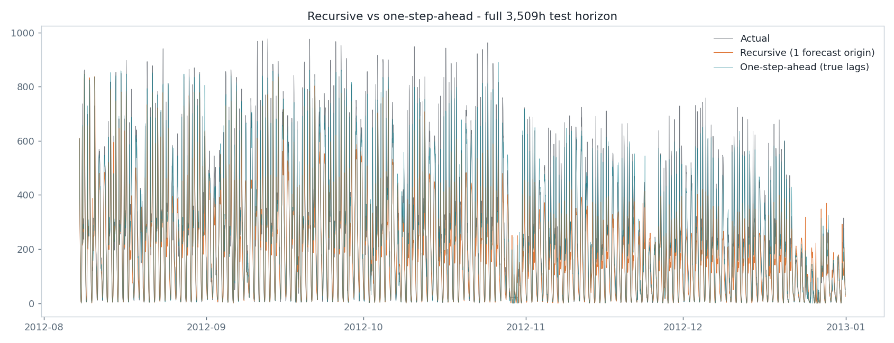
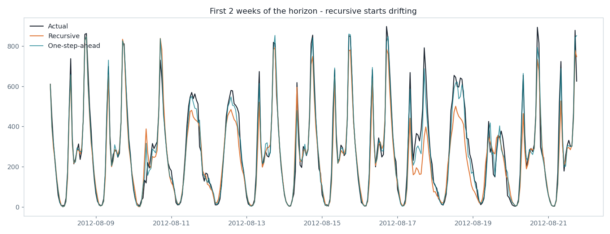
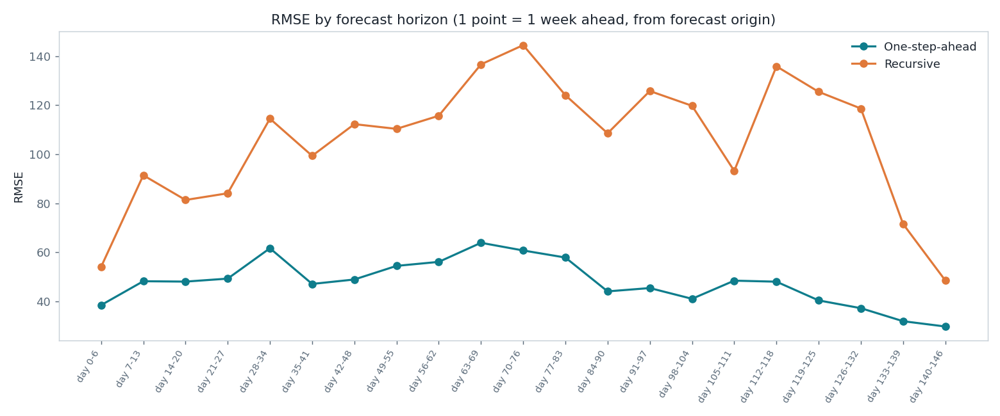

**Rolling recursive** re-anchors to real data every 24h instead. Sweeping
the re-anchor interval from 1h to 168h traces out the trade-off: most of
the damage happens in the first 24h, then flattens out.

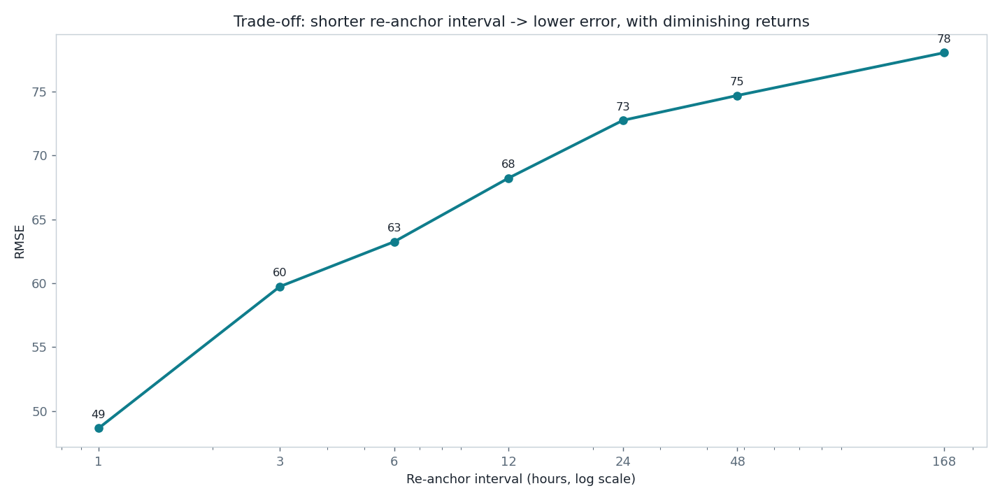

| Re-anchor every | RMSE | R2 |
|---|---|---|
| 1h | 48.6 | 0.951 |
| 3h | 59.7 | 0.927 |
| 6h | 63.3 | 0.918 |
| 24h | 72.8 | 0.891 |
| 168h | 78.1 | 0.875 |

Within a 24h re-anchor block, error isn't driven by "time since re-anchor"
alone - it's driven by *time of day*: quiet overnight hours stay accurate
even several hours into the block, while midday/evening demand swings blow
the error up regardless of how recently the model was re-anchored.

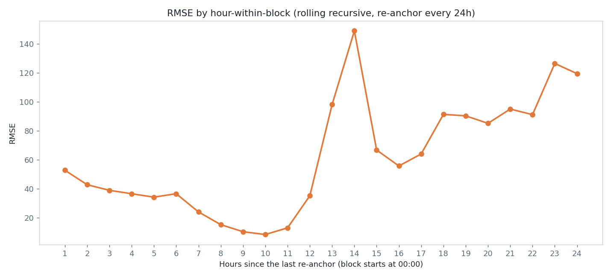

**Direct multi-step** trains 24 separate models (one per horizon h=1..24h),
each using only features defined relative to the *target* time (so they're
always true, never self-predicted - no recursion at all). It ends up
statistically tied with rolling recursive:

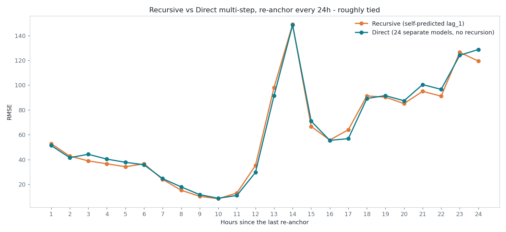

This tie makes sense in hindsight: within a 24h re-anchor block,
`lag_24`/`lag_168` are *already* always-true values for the recursive
model too (they only ever look further back than the block itself) - only
`lag_1` is genuinely recursive. So the two strategies end up conditioning
on almost the same information. Direct multi-step's real advantage isn't
accuracy at 24h, it's that it has **no unbounded compounding-error failure
mode** if the horizon is pushed further out (48h, 168h...) - at the cost of
needing a separate model per horizon.

**Recommendation**: use rolling recursive re-anchored as often as real data
is actually available in production (3-6h if the system supports it, 24h
at worst) - it matches direct multi-step's accuracy with a single model
instead of 24+.

---

## Repository layout

```
data/
  raw/            original dataset
  processed/      engineered train/test splits + windowed sequences
eda/              exploratory analysis + ACF/outlier scripts and plots
preprocessing/    feature engineering pipeline
modeling/         model comparison, hyperparameter tuning, final model
forecasting/      recursive / rolling-recursive / direct multi-step experiments
models/           saved final XGBoost model + hyperparameters
```
